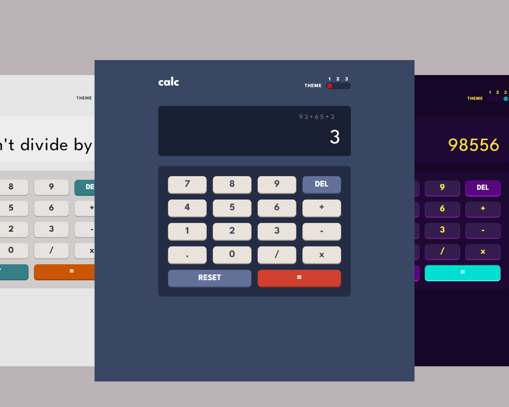
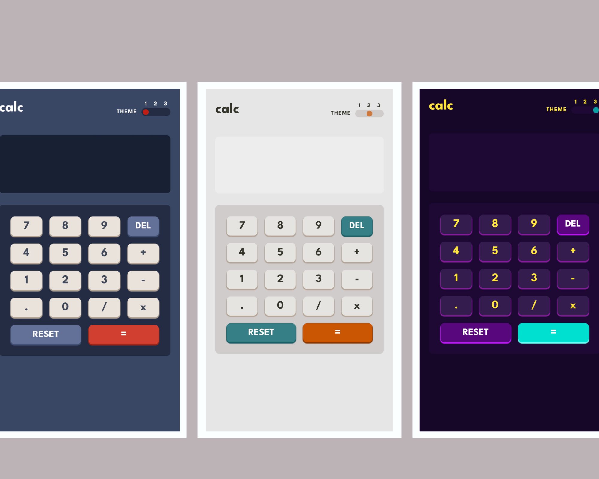

# Frontend Mentor - Calculator app solution

This is a solution to the [Calculator app challenge on Frontend Mentor](https://www.frontendmentor.io/challenges/calculator-app-9lteq5N29). Frontend Mentor challenges help you improve your coding skills by building realistic projects.

## Table of contents

- [Overview](#overview)
  - [Screenshot](#screenshot)
  - [Links](#links)
- [My process](#my-process)
  - [Built with](#built-with)
- [Author](#author)

### Screenshot

### Links

- Live Site URL: [https://acgeoffrey.github.io/calculator/]

## My process

Desktop first workflow (24inch Monitor, 1920x1080 px)

### Built with

- Semantic HTML5 markup
- CSS custom properties
- Flexbox
- CSS Grid
- Mobile-first workflow
  -JavaScript

## Author

- Frontend Mentor - [@acgeoffrey](https://www.frontendmentor.io/profile/acgeoffrey)
- Twitter - [@acgeoffrey](https://twitter.com/acgeoffrey)
